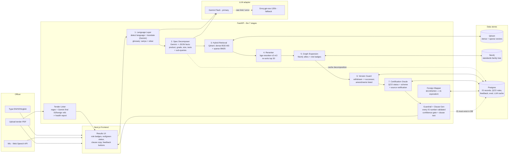
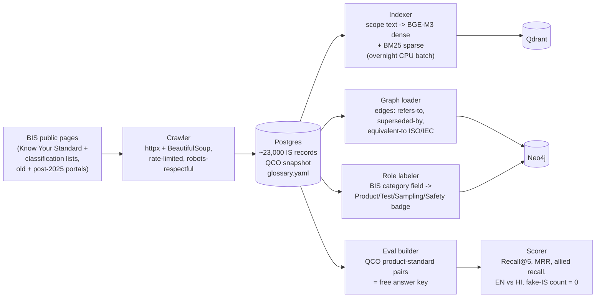

# Architecture — Manak Setu

How the system is put together: the live request path (what happens when an officer asks something), the offline data pipeline (how the data gets in), the data stores, and the repo layout.

---

## 1. The big picture (hospital metaphor)

| Hospital step | Manak Setu stage |
|---|---|
| Patient arrives with a complaint | Officer submits tender text (typed, spoken, or uploaded) |
| Triage nurse breaks the complaint into parts | **Spec Decomposer** extracts structured facts + sub-queries |
| Specialists are searched | **Hybrid retrieval** (BGE-M3 meaning + BM25 keywords) |
| Referral map shows which other specialists are needed | **Knowledge Graph** expansion with role labels |
| Pharmacy checks medicines aren't expired | **Version Guard** (withdrawn → successor) |
| Permits are verified | **Certification Oracle** (QCO status + scheme + source) |
| Doctor writes an evidenced report | **Guardrail + explainable output** (validated IS numbers, confidence, clause) |

---

## 2. Live request path (7-stage pipeline)

What happens the moment an officer submits a query. This is the diagram for the PPT.



### Stage-by-stage walkthrough

| # | Stage | Input | Output | Tool(s) |
|---|---|---|---|---|
| 1 | **Language layer** | Raw text/speech in any supported language | Normalized English query + detected language | Gemini (translate/normalize), vernacular glossary (`glossary.yaml`), browser Web Speech API |
| 2 | **Spec decomposer** | Normalized tender text | Structured JSON: product, material, grade, size, quantity, use-case, tests + 3–5 sub-queries | Gemini with JSON-mode prompt (cached in Postgres) |
| 3 | **Hybrid retrieval** | Sub-queries | Top ~50 candidates (fusion of dense + sparse) | Qdrant, BGE-M3 dense vectors, BM25 sparse vectors |
| 4 | **Reranker** | Query + top 30 candidates | Ordered top 5–10 | bge-reranker-v2-m3 (local, CPU) |
| 5 | **Graph expansion** | Top hits | Allied standards + role badges (Main / Test method / Sampling / Terminology / Safety / Installation / Raw material / Marking & packaging) | Neo4j traversal; roles pre-labelled offline |
| 6 | **Version guard** | Each candidate IS | Current-version status; withdrawn → red flag + successor; amendment list | Postgres records (supersession chain) |
| 7 | **Certification oracle** | Product / IS | Mandatory? scheme (ISI/CRS/Hallmarking) + notification date + source | Postgres QCO table (dated snapshot) |
| 8 | **Guardrail + output** | Everything above | Validated results (only IS numbers that exist in DB), confidence score, evidence text ("matched because…"), ready-to-paste clause | Postgres validation + Gemini clause writing; below confidence threshold → "ask a BIS expert" |

**Side modules (reuse the same engine):**
- **Tender Linter** — regex + LLM detect every IS/foreign-standard mention in an uploaded tender, then check each against Version Guard + Certification Oracle → health report (missing / outdated / foreign-only / contradiction).
- **Foreign mapper** — look up IEC/EN/ISO reference → IS equivalent from BIS equivalence field; unofficial matches labelled "suggested, needs expert review".
- **Gap analytics** — every query below the confidence threshold is logged; simple dashboard counts them per product category.

---

## 3. Offline data pipeline (Week 1–2, then re-runs)



**Key insight:** the BIS classification lists expose a category field (*Product Specification / Code of Practice / Methods of tests / Terminology / Dimensions / System Standard / Safety Standard*) — that is our role-badge source of truth, no LLM guessing required.

---

## 4. Data stores — who owns what

| Store | Holds | Why this one |
|---|---|---|
| **Qdrant** (Docker) | Dense vectors (BGE-M3) + sparse vectors (BM25) for every standard's title + scope | Native hybrid search (dense + sparse fusion) in one query |
| **Neo4j** (Docker) | Nodes = IS records; edges = *refers-to, referred-in, supersedes/superseded-by, equivalent-to ISO/IEC, committee-of* | Multi-hop traversal for "allied standards" — the exact thing plain vector search can't do. Fallback: NetworkX in-process graph if Neo4j is too heavy. |
| **Postgres** (Docker) | Standards metadata (number, title, status, revision, supersession chain), QCO/certification rules table, glossary, user feedback, eval results, **LLM response cache** | Relational facts + audit trail; one row per IS keeps guardrail validation trivial (`SELECT EXISTS`) |
| File system (`data/`) | Raw crawl JSONL, `qco_snapshot.yaml`, `glossary.yaml` | Version-controllable source of truth, reloadable into Postgres |

---

## 5. Request lifecycle — the "sariya" example, end to end

1. Mic captures → Web Speech API (`hi-IN`) returns Hinglish text: *"Bhawan nirman ke liye 12 mm sariya chahiye…"*
2. Language layer: language-ID says Hinglish → Gemini normalizes → English + glossary hits `sariya → steel reinforcement bar`
3. Decomposer returns: `{product: "reinforcement bar", size: "12 mm", qty: "500 t", use: "construction", needs_isi: true}` + sub-queries: `[product spec, tensile test method, sampling, marking & packaging, construction code]`
4. Qdrant returns 50 fused candidates → reranker orders them → top hit = steel bar standard
5. Neo4j walks edges → 4 allies, each with a role badge
6. Version Guard: all 5 = current (or red flag with successor)
7. Certification Oracle: QCO row → "ISI mark mandatory, per notification dated YYYY-MM-DD"
8. Guardrail: all 5 IS numbers exist in Postgres ✓, confidence 0.91 → Gemini writes the clause → UI shows bundle + copy button
9. User clicks 👍/👎 → feedback row in Postgres; below-threshold queries → gap-analytics log

---

## 6. Repo layout

```
Manak Setu/
├── README.md                     # the entire project idea
├── docs/
│   ├── project_context.md        # SIH facts, decisions, team, environment
│   ├── architecture.md           # this file
│   ├── tech_stack.md             # tools + cost + rationale
│   ├── prototype_plan.md         # scope + schedule + risks
│   └── demo_script.md            # judge walkthrough
├── docker-compose.yml            # web + api + qdrant + postgres + neo4j
├── .env.example                  # GEMINI_API_KEY, GROQ_API_KEY, DB URLs
├── apps/
│   └── web/                      # Next.js frontend
│       ├── app/                  # pages (home, results, linter, dashboard)
│       ├── components/           # InputBox, ResultCard, Badge, ClauseCopy…
│       └── lib/                  # API client, i18n strings (en/hi)
├── services/
│   └── api/                      # FastAPI backend
│       ├── main.py               # app entry
│       ├── routers/              # recommend, linter, feedback, eval
│       ├── stages/               # language, decompose, retrieve, rerank,
│       │                         # graph, version, certification, guardrail
│       ├── llm/                  # adapter: gemini.py, groq.py, prompts/
│       └── db/                   # Postgres access, Neo4j client, Qdrant client
├── pipeline/                     # offline jobs (Python scripts)
│   ├── crawl_bis.py              # crawler
│   ├── load_graph.py             # Postgres -> Neo4j
│   ├── index_vectors.py          # BGE-M3 + BM25 -> Qdrant (batch)
│   ├── label_roles.py            # category -> role badges
│   └── build_eval.py             # QCO pairs -> benchmark
├── data/
│   ├── raw/                      # crawl JSONL
│   ├── qco_snapshot.yaml         # certification rules (dated)
│   └── glossary.yaml             # vernacular product words
├── eval/
│   ├── benchmark.jsonl           # product -> expected IS pairs
│   └── results/                  # score reports (numbers for PPT)
└── scripts/
    └── dev.sh / dev.ps1          # docker compose up helpers
```

---

## 7. Deployment

- **Prototype:** `docker compose up` starts five containers — `web` (Next.js), `api` (FastAPI), `qdrant`, `postgres`, `neo4j` — on any laptop. Embedding/reranking run inside `api` (local Python models, no external calls).
- **LLM calls** are the only external dependency (Gemini primary, Groq fallback) — both behind one adapter interface so an open-weight model (vLLM) can replace them later for on-premise deployment, as the ministry would require.
- **Future (not in prototype):** embeddable widget for GeM/CPPP, Word/PDF add-in, official BIS data feed, live QCO watcher.
